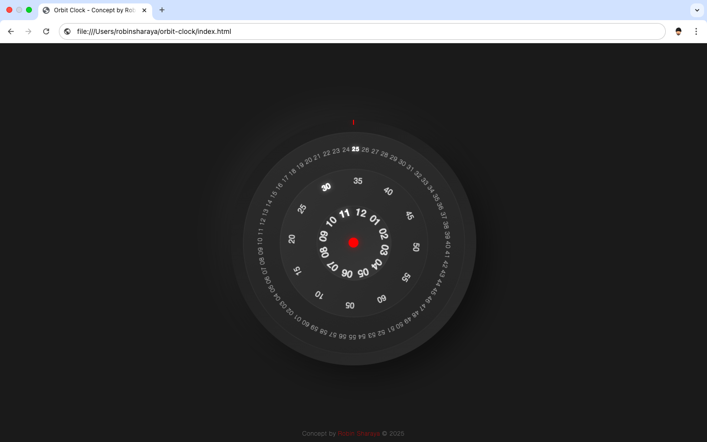

# Orbit Clock

A beautiful, interactive circular clock widget with orbital rings representing hours, minutes, and seconds. The design features concentric rings that rotate in real-time to display the current time.

## Features

- Elegant circular design with three concentric rings representing hours, minutes, and seconds
- Real-time animations with smooth transitions
- PWA support for offline usage and installation on mobile devices
- Responsive design that works on all device sizes
- Dark mode aesthetic with subtle glowing effects

## Live Demo

You can see a live demo of the Orbit Clock [here](https://iamrobinsharaya.github.io/orbit-clock/) .

## Installation

### Method 1: Direct Download

1. Download or clone this repository
2. Open `index.html` in your web browser

### Method 2: As a Progressive Web App

1. Visit the live demo URL on your mobile device
2. For iOS: Tap the share button and select "Add to Home Screen"
3. For Android: Tap the menu button and select "Install App" or "Add to Home Screen"

## Development

This project uses vanilla HTML, CSS, and JavaScript with no external dependencies.

To modify the project:

1. Edit the HTML/CSS in `index.html` to change the appearance
2. Modify the JavaScript portion for behavior changes
3. Update the PWA assets in the `assets` folder if needed

## Browser Support

- Chrome (latest)
- Firefox (latest)
- Safari (latest)
- Edge (latest)

## License

This project is licensed under the MIT License - see the [LICENSE](LICENSE) file for details.

## Acknowledgements

- Design concept by Robin Sharaya
- Created as a modern take on traditional clock widgets

---

© 2025 Robin Sharaya 
